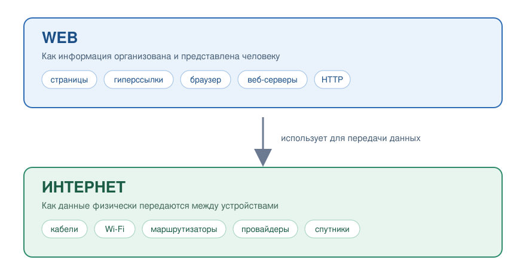
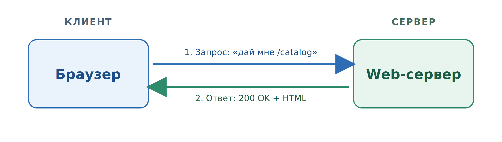
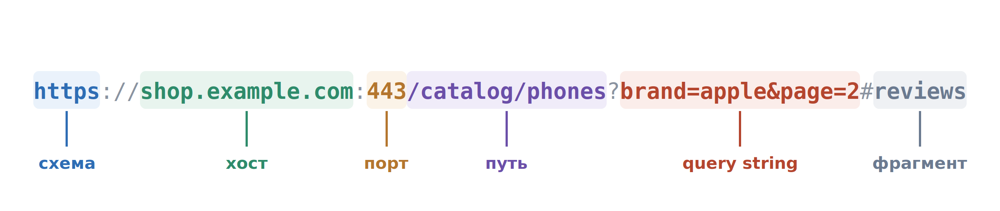

# Основы веб-разработки: Интернет, Веб и HTTP-протокол

## Содержание

- [Основы веб-разработки: Интернет, Веб и HTTP-протокол](#основы-веб-разработки-интернет-веб-и-http-протокол)
  - [Содержание](#содержание)
  - [Введение](#введение)
    - [Для кого данный курс?](#для-кого-данный-курс)
    - [Про что данный курс?](#про-что-данный-курс)
    - [Более детально о курсе](#более-детально-о-курсе)
    - [Как лучше изучать материал, чтобы он действительно остался в голове?](#как-лучше-изучать-материал-чтобы-он-действительно-остался-в-голове)
    - [Подытожим!](#подытожим)
  - [Как читать материалы курса](#как-читать-материалы-курса)
  - [От страницы к веб-приложению](#от-страницы-к-веб-приложению)
    - [Что Вы уже умеете?](#что-вы-уже-умеете)
    - [Где статическая страница перестаёт справляться](#где-статическая-страница-перестаёт-справляться)
  - [Интернет: как данные доходят от одного компьютера к другому](#интернет-как-данные-доходят-от-одного-компьютера-к-другому)
    - [Один компьютер, два компьютера](#один-компьютер-два-компьютера)
    - [Подключение к Интернету](#подключение-к-интернету)
    - [Как данные передаются через Интернет](#как-данные-передаются-через-интернет)
  - [Веб: что находится поверх Интернета](#веб-что-находится-поверх-интернета)
  - [Клиент-серверная модель взаимодействия](#клиент-серверная-модель-взаимодействия)
    - [Определение клиента и сервера](#определение-клиента-и-сервера)
    - [Устройство и программа](#устройство-и-программа)
    - [Что делает веб-сервер](#что-делает-веб-сервер)
    - [Роли относительны](#роли-относительны)
  - [URL: адрес ресурса](#url-адрес-ресурса)
  - [Что происходит, когда вы вводите адрес](#что-происходит-когда-вы-вводите-адрес)
    - [Один адрес - много запросов](#один-адрес---много-запросов)
  - [HTTP: правила разговора в вебе](#http-правила-разговора-в-вебе)
    - [Протокол](#протокол)
    - [Из чего состоит сообщение](#из-чего-состоит-сообщение)
    - [Что такое HTTP-запрос?](#что-такое-http-запрос)
    - [Что такое HTTP-ответ?](#что-такое-http-ответ)
    - [HTTP-методы](#http-методы)
    - [HTTP-заголовки](#http-заголовки)
    - [Коды состояния](#коды-состояния)
    - [Тело запроса и ответа](#тело-запроса-и-ответа)
    - [Аналогия из реальной жизни](#аналогия-из-реальной-жизни)
    - [Посмотрите на HTTP своими глазами](#посмотрите-на-http-своими-глазами)
    - [Общая модель функционирования Веба](#общая-модель-функционирования-веба)
  - [Технологии веб-разработки](#технологии-веб-разработки)
  - [Теперь вы знаете ...](#теперь-вы-знаете-)

## Введение

### Для кого данный курс?

Привет, дорогой читатель. Этот курс - вводное путешествие в устройство веба и основы веб-разработки. Его цель не просто показать технологии, а помочь понять, как работает веб и из каких компонентов он состоит.

Как и в любой другой области, материалов по веб-разработке существует огромное количество. Одни курсы уходят глубоко в детали, другие дают лишь поверхностное представление. Данный курс занимает осознанно выбранную позицию между этими крайностями.

Он направлен на то, чтобы дать базовые и системные знания, сформировать правильное понимание основ и, что не менее важно, заинтересовать и вдохновить на дальнейшее изучение веб-разработки. Автору данного курса будет крайне приятно, если после его прохождения несколько студентов выберут веб-разработку в качестве направления своего дальнейшего профессионального развития.

Курс рассчитан в первую очередь на начинающих студентов, а также на тех, кто хочет структурировать и обновить уже имеющиеся знания в данной области.

### Про что данный курс?

Как уже было отмечено выше, данный курс посвящён веб-разработке и, в частности, изучению языка программирования PHP как основы для создания веб-приложений. Возникает логичный вопрос: почему именно PHP? Ответ здесь достаточно простой. Этот язык позволяет относительно легко и наглядно войти в мир веб-разработки и понять её базовые принципы без лишнего усложнения. PHP хорошо подходит для первого знакомства с серверной частью веба. На его примере удобно разбирать, как обрабатываются запросы, как работает логика приложения и как данные взаимодействуют с пользователем.

Если говорить в общих чертах, то по завершении курса вы сможете создавать динамические веб-приложения. Не просто статические страницы, а полноценные сайты, с которыми пользователь может взаимодействовать: регистрироваться, входить в систему, обновлять данные и работать с контентом. Например, вы сможете создавать такие веб-приложения, как Habr, Github.

Именно к такому уровню понимания и практики мы будем постепенно двигаться на протяжении курса.

### Более детально о курсе

Данный курс разделён на три основные части:

- _Изучение языка PHP_. В этой части студенты знакомятся с основами языка PHP, которые в дальнейшем будут использоваться при изучении веб-разработки.
- _Основы веб-разработки_. Здесь рассматриваются базовые механизмы и принципы работы веба, а также то, как взаимодействуют браузер, сервер и пользователь.
- _Продвинутые главы веб-разработки_. В этой части предполагается изучение более сложных концепций, обсуждение дальнейших направлений развития и введение в работу с фреймворками.

Курс рассчитан на _15 лекционных занятий_ и _15 лабораторных занятий_. В рамках самостоятельной работы студентам предлагается выполнить 6 лабораторных работ и несколько дополнительных упражнений для закрепления материала.

Важно отметить, что в теоретическом материале ответы не всегда будут даны сразу. Иногда вам, как читателю, придётся остановиться, подумать или запустить код самостоятельно, чтобы разобраться, почему программа ведёт себя именно так. Это сделано намеренно. Веб-разработка требует не только запоминания, но и умения анализировать и понимать происходящее.

### Как лучше изучать материал, чтобы он действительно остался в голове?

В целом, это довольно философский вопрос. У каждого свой ритм, свои привычки и способы обучения. Я могу лишь дать несколько практических советов, которые хорошо сработали у меня.

- _Изучайте не более одной темы в день_. Не стоит пытаться охватить всё сразу, даже если кажется, что "всё влезет". Информация, усвоенная медленно, почти всегда оказывается полезнее.
- _Не просто читайте, а запускайте код_. Держите рядом редактор кода и выполняйте каждый пример, который встречаете. Меняйте значения, ломайте код, смотрите, что произойдёт. Пытайтесь понять, почему результат именно такой. В этом месте листок и ручка всё ещё отлично работают.
- _Одна только практика без цели тоже не работает_. Обязательно выполняйте все лабораторные работы, которые есть в курсе, стараясь делать это без использования ИИ. Как получится. Уже после этого можно проверить себя с помощью ИИ и сравнить подходы.
- _Используйте ИИ как тренажёр, а не как костыль_. Попросите ИИ задавать вам задачи по текущей теме и решайте их самостоятельно. Это хороший способ проверить, действительно ли вы поняли материал.
- _Пытайтесь делать собственный проект_. Выберите тему и начните разрабатывать свой проект, каким бы "кривым" он ни получился на первых этапах. Старайтесь по возможности не использовать ИИ - к нему вы ещё успеете обратиться в процессе работы. Гораздо важнее на этом этапе самостоятельно разобраться в устройстве веб-приложений и логике их работы.

Отдельно дам ещё один совет, который лично мне очень помог. После прохождения темы попробуйте объяснить её своему "коллеге по цеху", просто другу или партнеруы. А ещё лучше - человеку с другого факультета, который в IT ничего не понимает. _Это удивительно эффективная практика_. В такие моменты вы быстро понимаете, где сами "плаваете", а где действительно разобрались. Вы начинаете не просто запоминать, а понимать материал. Для этого вполне можно использовать презентации и схемы из данного курса.

### Подытожим!

Цель данного курса - _помочь студенту погрузиться в мир веб-разработки_, понять его основы и задать правильное направление для дальнейшего развития.

Вперёд? Вперёд.

## Как читать материалы курса

Материалы курса оформлены единообразно, и знание этих правил сэкономит вам время.

- **Жирным шрифтом** выделяется новый термин в том месте, где даётся его определение.
- _Курсивом_ выделяется смысловой акцент, то есть слово или фраза, на которую стоит обратить внимание.
- `Моноширинным текстом` записываются фрагменты кода, имена переменных и функций, HTTP-заголовки, SQL-запросы, URL, имена файлов и команды терминала.
- Ссылки вида [^1] ведут на источник в разделе "Библиография" в конце лекции.

В тексте встречаются четыре типа примечаний.

> [!NOTE]
> Дополнительное пояснение или уточнение. Полезно знать, но не критично.

> [!IMPORTANT]
> Ключевая мысль раздела. Если вы запомните из главы одно предложение, пусть это будет оно.

> [!WARNING]
> Ошибка, которая приводит к неработающему или небезопасному коду.

> [!TIP]
> Практический совет: как сделать удобнее, быстрее или проще.

Схемы нумеруются в формате "номер лекции.номер схемы", например "Схема 1.3". В тексте на них ссылаются по номеру, а не словами "на картинке выше".

И последнее. Читать этот курс, не открывая редактор кода, почти бесполезно. Любой пример, который занимает больше двух строк, стоит запустить у себя и сломать: изменить значение, удалить строку, посмотреть, что произойдёт. Понимание приходит именно оттуда.

## От страницы к веб-приложению

### Что Вы уже умеете?

Представим, что вы делаете небольшой интернет-магазин. Назовём его `MiniShop`. К этому учебному проекту мы будем возвращаться на протяжении всего курса.

Вы вполне можете написать файл `index.html`, красиво оформить его через CSS и добавить немного JavaScript: выпадающее меню, слайдер картинок, подсветку выбранного товара. Откроете файл в браузере - всё работает.

Это **статическая страница**, то есть страница, содержимое которой заранее записано в файл и одинаково для всех посетителей.

### Где статическая страница перестаёт справляться

Теперь добавим к магазину обычные требования.

- В каталоге 500 товаров, и они меняются каждый день.
- Цены обновляет менеджер, а не программист.
- Пользователь может зарегистрироваться и войти в свой аккаунт.
- Пользователь кладёт товар в корзину, закрывает браузер, возвращается завтра, и корзина на месте.
- Пользователь оставляет отзыв, и этот отзыв видят все остальные.

Ни одно из этих требований нельзя выполнить на статических файлах. Причин две.

- _Во-первых_, пришлось бы вручную писать 500 HTML-файлов и переписывать их при каждом изменении цены.
- _Во-вторых_, и это важнее: _данные должны сохраняться где-то, кроме компьютера пользователя_. Отзыв, который Иван оставил в своём браузере, должна увидеть Мария в своём. Значит, отзыв обязан попасть на какой-то общий компьютер, доступный всем.

JavaScript в браузере эту задачу не решает. Он выполняется у каждого пользователя отдельно и ничего не знает о других.

> [!IMPORTANT]
> Нам нужна программа, которая выполняется _не_ в браузере пользователя, а на общем компьютере, доступном всем пользователям. Такая программа называется **серверной**.

Прежде чем перейти к PHP, надо разобраться, как устроен этот "общий компьютер" и как браузер с ним разговаривает.

## Интернет: как данные доходят от одного компьютера к другому

Перед тем как рассматривать понятия "Интернет" и "Web", нужно вспомнить, как данные передаются от одного компьютера к другому.

### Один компьютер, два компьютера

Представим простую ситуацию. В комнате стоит компьютер, он включён и работает, но никуда не подключён. В таком состоянии он изолирован: обмениваться данными ему просто не с кем.

Теперь поставим рядом второй компьютер и соединим их сетевым кабелем напрямую. Два компьютера смогут передавать информацию друг другу. Пока не важно, в каком формате и по каким правилам, важен сам факт связи.

Но это ещё не Интернет. Открыть google.com вы в такой конфигурации не сможете. Это всего лишь два компьютера, которые видят друг друга.

### Подключение к Интернету

Чтобы появился доступ к Интернету, нужно обратиться к _интернет-провайдеру_. Специалисты подключают дом к сети провайдера и обычно устанавливают маршрутизатор (роутер), к которому подключаются устройства: компьютер по кабелю, телефон и ноутбук по Wi-Fi.

Провайдер не "создаёт" Интернет. Он подключает ваш дом к своей "сети", а его "сеть" связана с сетями других провайдеров по всему миру. Из множества таких соединённых сетей Интернет и состоит.

**Интернет** - это глобальная сеть соединённых между собой компьютерных сетей, обеспечивающая передачу данных между устройствами[^1]. Это провода, оптоволокно, Wi-Fi, маршрутизаторы, провайдеры и спутники. Интернет отвечает на вопрос "как физически доставить данные из точки A в точку B".

### Как данные передаются через Интернет

Разберём путь данных на примере.

У парня из Молдовы по имени Андрей есть знакомая в Мексике по имени Валенсия. Андрей хочет отправить ей сообщение: "Привет! Как у тебя сегодня дела?". Что происходит после нажатия кнопки "Отправить"?

1. _С устройства на роутер_. Сообщение уходит с компьютера или телефона Андрея на домашний роутер - по Wi-Fi или по кабелю.
2. _От роутера к провайдеру_. С роутера данные уходят по каналам связи к провайдеру (например, starnet). На этом шаге сообщение покидает домашнюю сеть.
3. _Маршрутизация_. Дальше сообщение проходит через цепочку маршрутизаторов и сетей других провайдеров. Каждый маршрутизатор смотрит на адрес назначения и решает, куда передать данные дальше. Это похоже на серию перекрёстков, где на каждом выбирается следующий поворот.
4. _Пересечение океана_. Сообщение идёт по магистральным линиям и международным узлам, а между континентами - по кабелям, проложенным по дну океана. Да, буквально по дну.
5. _Доставка на сервер сервиса_. Сообщение попадает не сразу на устройство Валенсии, а на сервер мессенджера, через который Андрей пишет.
6. _Обработка и доставка_. Сервер сохраняет сообщение и передаёт его Валенсии, когда её устройство выходит на связь.

Для пользователя всё это выглядит мгновенным, хотя на пути оказываются десятки сетевых устройств.

## Веб: что находится поверх Интернета

Интернет умеет доставлять данные, но ничего не говорит о том, что это за данные и как их показать человеку. Этим занимается Веб.

**Интернет** - это глобальная сеть соединённых между собой компьютерных сетей, обеспечивающая передачу данных между устройствами. Это провода, оптоволокно, Wi-Fi, маршрутизаторы, провайдеры, спутники. Интернет отвечает на вопрос "как физически доставить данные из точки A в точку B".

**Web (World Wide Web)** - это система связанных между собой документов и приложений, доступных через браузер и передаваемых по сети Интернет. Web отвечает на вопрос "как эти данные организованы, связаны и показаны человеку".

Web работает _поверх_ Интернета, как почтовая служба работает поверх дорожной сети.



_Рисунок 1.1. Web работает поверх Интернета_

Простой аргумент в пользу того, что это разные вещи: по Интернету работает не только Web. Электронная почта, онлайн-игры, видеозвонки, обновления операционной системы тоже идут через Интернет, но страницами в браузере не являются.

Из чего состоит Web:

- _Веб-страница_ - отдельный документ, который отображается в браузере и содержит текст, изображения, видео и другие элементы.
- _Веб-сайт_ - совокупность связанных веб-страниц, объединённых общей темой.
- _Веб-приложение_ - программа, работающая в браузере и не требующая установки на устройство пользователя. В отличие от обычного сайта, приложение предполагает активное взаимодействие: социальные сети, онлайн-банкинг, интернет-магазины.
- _Браузер_ - программа, которая запрашивает и показывает страницы.
- _Web-сервер_ - программа, которая "отдаёт" веб-страницы по запросу клиентов.
- _Ресурсы_: HTML-страницы, изображения, стили, скрипты, файлы.
- _Гиперссылки_, связывающие ресурсы между собой.
- _Протокол HTTP_, задающий правила обмена.

Каждый из этих компонентов мы разберём дальше.

Теперь рассмотрим как именно работает Web, и как мы, заходя на сайт через браузер, получаем нужную страницу.

## Клиент-серверная модель взаимодействия

Веб устроен по клиент-серверной модели. В ней всегда есть тот, кто спрашивает, и тот, кто отвечает. Разберёмся с обеими ролями.

### Определение клиента и сервера

**Клиент** - это устройство или программа, которая отправляет запрос и ожидает ответ.

**Сервер** - это устройство или программа, которая принимает запросы, обрабатывает их и отправляет ответы.

**Запрос (request)** - сообщение, которое клиент отправляет серверу.

**Ответ (response)** - сообщение, которое сервер отправляет клиенту в ответ на запрос.

Грубо говоря, когда я хочу получить веб-страницу, мой браузер выступает клиентом и отправляет запрос серверу, который отдаст нужную страницу в ответ.



_Рисунок 1.2. Базовое взаимодействие клиента и сервера_

Обратите внимание на направление стрелок. В классическом HTTP _разговор всегда начинает клиент_. Сервер не может сам, по своей инициативе, прислать браузеру страницу. Он только отвечает на то, о чём его спросили.

### Устройство и программа

В определениях выше не случайно написано "устройство или программа". И "клиент", и "сервер" в разговоре означают две разные вещи, и это стоит развести сразу.

| Термин | Как устройство                                 | Как программа                                   |
| ------ | ---------------------------------------------- | ----------------------------------------------- |
| Клиент | Ноутбук, телефон, планшет пользователя         | Браузер, мобильное приложение                   |
| Сервер | Машина в дата-центре, работающая круглосуточно | Веб-сервер, сервер базы данных, почтовый сервер |

Когда мы говорим "запрос ушёл с клиента на сервер", почти всегда речь идёт о программах: браузер отправил, веб-сервер принял. На одном физическом компьютере может одновременно работать несколько серверных программ, и наоборот, одна программа может обслуживать миллионы запросов.

Самый привычный клиент - браузер. Но клиентом может быть и мобильное приложение, и другая программа.

### Что делает веб-сервер

Если на стороне пользователя понятно, кто запрашивает страницу, то теперь нужно разобратся, а куда браузер отправляет этот запрос.

Браузер отправляет запрос на "сервер" - физическую машину, которая отдаёт нужную страницу в ответ.

**Веб-сервер** - это программа на сервере, которая принимает запросы от клиентов и возвращает им нужные ресурсы: HTML-страницы, изображения, файлы и другие данные.

Его работа сводится к трём шагам:

1. _Принять запрос._ Например, запрос на получение страницы каталога.
2. _Обработать его._ Найти нужный файл на диске или, если ответ надо создать на лету, передать работу другой программе, которая соберет ответ.
3. _Отправить ответ._ Клиент получает данные и отображает их пользователю.

> [!TIP]
>
> Отдавать веб-сервер может что угодно: HTML-страницы, изображения, стили, скрипты, файлы.

### Роли относительны

Клиент и сервер - это не типы устройств, а _роли в конкретном обмене_. Одна и та же программа может быть и тем, и другим.

Возьмём приложение погоды:

1. Браузер запрашивает прогноз у вашего веб-сервера. Браузер - клиент, ваш сервер - сервер.
2. Ваш сервер сам не знает прогноз и обращается за ним к метеослужбе. В этом обмене ваш сервер - уже клиент, а сервер метеослужбы - сервер.

Главное, что стоит запомнить: тот, кто запрашивает, - _клиент_; тот, кто отвечает, - _сервер_. Одна и та же машина может быть и тем, и другим в разных обменах.

> [!NOTE]
> Ваш собственный ноутбук тоже может работать как web-сервер. Именно так вы будете разрабатывать: сервер, PHP и браузер будут запущены на одной машине. Это удобно и совершенно нормально для обучения.

## URL: адрес ресурса

Чтобы что-то запросить, надо уметь это что-то назвать. В вебе для этого служит адрес. Для этого используется **URL**.

**URL (Uniform Resource Locator)** - строка, которая указывает расположение ресурса в сети и способ доступа к нему[^6].

Рассмотрим пример URL и разберём его на части.



_Рисунок 1.3. Составные части URL_

| Часть        | Назначение                                         | В примере            |
| ------------ | -------------------------------------------------- | -------------------- |
| Схема        | Протокол доступа к ресурсу                         | `https`              |
| Хост         | Имя сервера, к которому идёт обращение             | `shop.example.com`   |
| Порт         | Номер "двери" на сервере. Обычно не пишется        | `443`                |
| Путь         | Какой именно ресурс нужен на этом сервере          | `/catalog/phones`    |
| Query string | Дополнительные параметры запроса                   | `brand=apple&page=2` |
| Фрагмент     | Место внутри страницы, к которому нужно прокрутить | `reviews`            |

> [!NOTE]
> Вы встретите также термин **URI (Uniform Resource Identifier)**. URI - более общее понятие, идентификатор ресурса. URL - это URI, который дополнительно говорит, _где_ и _как_ ресурс получить. В повседневной работе с Web разница редко существенна, но знать её стоит.

## Что происходит, когда вы вводите адрес

Теперь, когда мы знаем, что такое клиент, сервер и адрес, можно проследить весь путь целиком. Пользователь ввёл в адресной строке `http://minishop.md/catalog` и нажал Enter.

1. _Разбор адреса._ Браузер разбирает адрес и выделяет имя сервера: `minishop.md`.
2. _Поиск IP-адреса._ Браузер обращается к службе DNS, чтобы узнать, какому IP-адресу соответствует это имя. DNS работает как телефонная книга: по имени возвращает числовой адрес.
3. _Установка соединения._ Браузер соединяется с сервером по полученному адресу.
4. _Отправка запроса._ Браузер формирует сообщение-запрос и отправляет его.
5. _Обработка на сервере._ Веб-сервер принимает запрос и решает, что с ним делать: отдать готовый файл или запустить программу, которая создаст ответ.
6. _Отправка ответа._ Сервер формирует сообщение-ответ и отправляет его браузеру.
7. _Отображение._ Браузер разбирает полученный HTML и рисует страницу.

### Один адрес - много запросов

Есть деталь, о которой часто забывают. Одна открытая страница - это почти никогда не один запрос.

Браузер получает HTML, читает его и находит внутри ссылки на другие ресурсы: `<link>` на файл стилей, `<script>` на JavaScript, `` на изображения. За каждым из них он отправляет _отдельный_ запрос по той же схеме.

Средняя страница современного сайта - это несколько десятков запросов. В конце лекции в практической части мы это увидим на примере реального сайта.

## HTTP: правила разговора в вебе

Мы разобрались, кто с кем разговаривает. Осталось понять, по каким правилам идёт этот разговор.

Браузер не может отправить серверу сообщение вида "эй, дай мне эту страницу", а сервер не может ответить "держи". Сервер - это программа, и произвольный текст она не поймёт. Значит, обе стороны должны заранее договориться: _как выглядит запрос, как выглядит ответ, где в сообщении находится адрес нужного ресурса, а где само содержимое_.

Такая договорённость существует и называется протоколом. Он строго определяет формат запроса и ответа, поэтому браузер и сервер, написанные разными людьми в разных странах, понимают друг друга без дополнительных соглашений. В случае веба таким протоколом является **HTTP**.

### Протокол

**Протокол** - это набор правил и соглашений, которые определяют, как устройства обмениваются данными между собой. В случае HTTP это означает, что браузер и сервер взаимодействуют строго по определённым правилам: как должен выглядеть запрос, какие данные он может содержать и в каком формате сервер должен вернуть ответ.

**HTTP (HyperText Transfer Protocol)** - это широко распространённый протокол передачи гипертекста (HyperText Transfer Protocol).[^3].

HTTP определяет три вещи:

- Как выглядит запрос.
- Как выглядит ответ.
- Что означают отдельные элементы этих сообщений: методы, заголовки, коды состояния.

> [!NOTE]
> Существует несколько версий протокола. HTTP/1.1 передаёт сообщения обычным текстом, поэтому его удобно читать и изучать. HTTP/2 и HTTP/3 упаковывают те же данные в двоичный формат ради скорости, но _смысл_ сообщений остаётся прежним: те же методы, заголовки и коды состояния[^1]. Всё, что вы изучите на примере HTTP/1.1, останется верным.

Проще говоря, HTTP - это строгие правила общения между клиентом и сервером в Вебе. Он определяет, что именно браузер может попросить у сервера и как именно сервер должен на это ответить. Если совсем упростить, HTTP можно представить как заранее оговорённый язык общения, на котором «разговаривают" браузеры и веб-серверы.

### Из чего состоит сообщение

Запрос и ответ устроены по одной общей схеме и состоят из трёх частей:

1. **Стартовая строка** - самая важная информация о сообщении. Одна строка, обязательна.
2. **Заголовки** - дополнительные сведения о сообщении. Их может быть много, а может не быть вовсе.
3. **Тело** - содержимое сообщения. Есть не всегда.

Между заголовками и телом стоит пустая строка. Именно по ней принимающая сторона понимает, что заголовки закончились.

Различаются запрос и ответ только содержимым стартовой строки. Разберём каждый по отдельности.

### Что такое HTTP-запрос?

**HTTP-запрос (HTTP request)** - сообщение, отправляемое клиентом серверу, с информацией о том, что именно клиент хочет получить.

Стартовая строка запроса содержит три элемента:

1. Метод, то есть что клиент хочет сделать.
2. Путь к ресурсу.
3. Версию протокола.

Например, когда вы заходите на веб-сайт `google.com`, ваш браузер отправляет серверу следующую информацию:

```http
GET / HTTP/1.1
Host: google.com
```

Когда вы заходите на веб-сайт `999.md/cars`, ваш браузер отправляет серверу `999.md` следующую строку:

```http
GET /cars HTTP/1.1
Host: 999.md
```

Это означает, что клиент хочет получить страницу с объявлениями о продаже автомобилей.

### Что такое HTTP-ответ?

**HTTP-ответ (HTTP response)** - сообщение, которое сервер отправляет клиенту в ответ на запрос.

Стартовая строка ответа тоже содержит три элемента:

1. Версию протокола.
2. Код состояния, то есть результат обработки _числом_.
3. Текстовое описание этого кода.

Например, когда вы заходите на веб-сайт, сервер отправляет вашему браузеру следующую строку:

```http
HTTP/1.1 200 OK
Content-Type: text/html; charset=UTF-8

<html>
  <head>
    <title>Пример страницы</title>
  </head>
  <body>
    <h1>Добро пожаловать!</h1>
  </body>
</html>
```

Теперь подробнее рассмотрим каждую из частей запроса и ответа.

Теперь разберём подробнее каждый элемент этих сообщений.

### HTTP-методы

**HTTP-метод** - элемент стартовой строки запроса, указывающий, какое действие клиент хочет выполнить над ресурсом[^4].

Проще говоря, обращаясь к серверу, надо сказать, что именно вы хотите сделать. Прочитать статью на Википедии - это одно действие. Создать новую статью - совсем другое. Удалить её - третье. Метод как раз и различает эти намерения.

Стандарт определяет 10 методов, но чаще всего используются следующие:

| Метод    | Назначение                                        | Пример запроса       | Есть ли тело |
| -------- | ------------------------------------------------- | -------------------- | ------------ |
| `GET`    | Получить содержимое ресурса                       | `GET /products`      | Нет          |
| `POST`   | Создать новый ресурс                              | `POST /products`     | Да           |
| `PUT`    | Полностью заменить существующий ресурс            | `PUT /products/5`    | Да           |
| `PATCH`  | Частично обновить существующий ресурс             | `PATCH /products/5`  | Да           |
| `DELETE` | Удалить ресурс                                    | `DELETE /products/5` | Обычно нет   |
| `QUERY`  | Получить данные, передав параметры запроса в теле | `QUERY /products`    | Да           |

> [!NOTE]
> Метод `QUERY` появился недавно: он был опубликован как RFC 10008 в июне 2026 года и стал первым новым методом общего назначения с момента появления `PATCH` в 2010 году[^1]. Он решает давнюю проблему: `GET` не может нести тело запроса, поэтому сложные условия поиска приходилось упаковывать в адрес или отправлять через `POST`, теряя при этом гарантии безопасного метода. `QUERY` безопасен и идемпотентен, как `GET`, но передаёт параметры в теле, как `POST`.

Каждый метод должен использоваться в соответствии со своим назначением. Например, метод `GET` предназначен для получения данных, а метод `POST` - для создания новых ресурсов. Сервер ожидает, что методы будут использоваться в соответствии с их стандартами.

> [!IMPORTANT]
>
> Важно понимать, что HTTP-метод - это всего лишь информация, передаваемая серверу. Технически вы можете написать серверный код так, что `GET /delete-user/5` будет удалять пользователя. Но такой подход нарушает стандарт, ломает совместимость с другими клиентами, а поисковый робот, обойдя ваш сайт, аккуратно удалит всех пользователей.
>
> Представьте, что вы пришли в автосервис с просьбой починить машину, а её вместо этого отправили на металлолом. Формально что-то сделали, но явно не то, чего ожидали.

### HTTP-заголовки

**HTTP-заголовки (headers)** - строки вида `Имя: значение`, передающие дополнительную информацию о сообщении[^5].

Проще говоря, заголовки - это дополнительные сведения, сопровождающие запрос или ответ. Если бы стороны обменивались только методом и телом, они почти ничего не знали бы друг о друге: ни в какой кодировке текст, ни какой формат нужен клиенту, ни кто вообще обращается.

Заголовки располагаются между стартовой строкой и телом сообщения. Вот более полный пример запроса:

```http
GET /cars HTTP/1.1
Host: 999.md
User-Agent: Mozilla/5.0 (Windows NT 10.0; Win64; x64) Chrome/120.0
Accept: text/html,application/xhtml+xml
Accept-Language: ru-RU,ru;q=0.9
Connection: keep-alive
```

И ответ на него:

```http
HTTP/1.1 200 OK
Date: Mon, 15 Sep 2026 10:22:41 GMT
Server: nginx
Content-Type: text/html; charset=UTF-8
Content-Length: 348

<!DOCTYPE html>
<html>
  <head>
    <title>Автомобили</title>
  </head>
  <body>
    <h1>Объявления о продаже</h1>
  </body>
</html>
```

Наиболее часто встречающиеся заголовки:

| Заголовок         | Где встречается | Что означает                              |
| ----------------- | --------------- | ----------------------------------------- |
| `Host`            | Запрос          | Имя запрашиваемого сервера                |
| `User-Agent`      | Запрос          | Браузер и операционная система клиента    |
| `Accept`          | Запрос          | Какие форматы данных клиент готов принять |
| `Accept-Language` | Запрос          | Предпочитаемый язык ответа                |
| `Content-Type`    | Оба             | Формат содержимого тела сообщения         |
| `Content-Length`  | Оба             | Размер тела в байтах                      |
| `Location`        | Ответ           | Адрес, на который следует перейти         |

Если бы в сообщении были только метод и тело, стороны почти ничего не знали бы друг о друге: ни в какой кодировке текст, ни какой формат нужен клиенту, ни кто вообще обращается.

Браузер подставляет большинство заголовков автоматически, и пользователь об этом не задумывается.

> [!IMPORTANT]
> Заголовки приходят от клиента, а значит, их содержимое контролирует клиент. `User-Agent` можно подделать одной командой. Никакое решение о безопасности нельзя принимать на основании заголовка запроса. К этой мысли мы будем возвращаться на протяжении всего курса.

### Коды состояния

**Код состояния (status code)** - трёхзначное число в стартовой строке ответа, сообщающее клиенту результат обработки запроса[^7].

Код позволяет клиенту понять итог, _не разбирая тело ответа_. Именно по нему браузер понимает, получена ли страница, произошла ли ошибка и на чьей она стороне.

Существует множество кодов состояний, с которыми вам предстоит столкнуться.

Коды состояний делятся на следующие группы:

<table border="1">
  <tr>
    <th>Категория</th>
    <th>Код</th>
    <th>Название на английском</th>
    <th>Описание</th>
  </tr>
  <tr>
    <td rowspan="3"><b>1xx: Информационные сообщения</b></td>
    <td>100</td>
    <td>Continue</td>
    <td>Сервер готов продолжить обработку запроса</td>
  </tr>
  <tr>
    <td>101</td>
    <td>Switching Protocols</td>
    <td>Сервер согласен изменить протокол</td>
  </tr>
  <tr>
    <td>...</td>
    <td></td>
    <td></td>
  </tr>
  <tr>
    <td rowspan="4"><b>2xx: Успешное выполнение запроса</b></td>
    <td>200</td>
    <td>OK</td>
    <td>Запрос успешно выполнен</td>
  </tr>
  <tr>
    <td>201</td>
    <td>Created</td>
    <td>Запрос успешно выполнен, создан новый ресурс</td>
  </tr>
  <tr>
    <td>204</td>
    <td>No Content</td>
    <td>Запрос успешно выполнен, но ответ не содержит содержимого</td>
  </tr>
  <tr>
    <td>...</td>
    <td></td>
    <td></td>
  </tr>
  <tr>
    <td rowspan="3"><b>3xx: Перенаправление</b></td>
    <td>301</td>
    <td>Moved Permanently</td>
    <td>Запрашиваемый ресурс был окончательно перемещен на новый URL</td>
  </tr>
  <tr>
    <td>302</td>
    <td>Found</td>
    <td>Запрашиваемый ресурс временно перемещен на другой URL</td>
  </tr>
  <tr>
    <td>...</td>
    <td></td>
    <td></td>
  </tr>
  <tr>
    <td rowspan="7"><b>4xx: Ошибка клиента</b></td>
    <td>400</td>
    <td>Bad Request</td>
    <td>Сервер не может обработать запрос из-за неверного синтаксиса</td>
  </tr>
  <tr>
    <td>401</td>
    <td>Unauthorized</td>
    <td>Требуется аутентификация пользователя</td>
  </tr>
  <tr>
    <td>403</td>
    <td>Forbidden</td>
    <td>Сервер отказывает в доступе к ресурсу</td>
  </tr>
  <tr>
    <td>404</td>
    <td>Not Found</td>
    <td>Запрашиваемый ресурс не найден</td>
  </tr>
  <tr>
    <td>405</td>
    <td>Method Not Allowed</td>
    <td>Метод не поддерживается сервером</td>
  </tr>
  <tr>
    <td>418</td>
    <td>I'm a teapot</td>
    <td>«Я - чайник"</td>
  </tr>
  <tr>
    <td>...</td>
    <td></td>
    <td></td>
  </tr>
  <tr>
    <td rowspan="3"><b>5xx: Ошибка сервера</b></td>
    <td>500</td>
    <td>Internal Server Error</td>
    <td>Сервер столкнулся с ошибкой при обработке запроса</td>
  </tr>
  <tr>
    <td>503</td>
    <td>Service Unavailable</td>
    <td>Сервер временно не может обрабатывать запросы</td>
  </tr>
  <tr>
    <td>...</td>
    <td></td>
    <td></td>
  </tr>
</table>

> [!IMPORTANT]
>
> Обратите внимание на разницу между `401` и `403`. `401` означает "я не знаю, кто ты, представься". `403` означает "я знаю, кто ты, и тебе сюда нельзя".

При разработке веб-приложений разработчики нередко пренебрегают корректным использованием HTTP-кодов и в случае ошибки возвращают статус `200 OK`. Это является плохой практикой. В такой ситуации клиент не может понять, что произошла ошибка, так как код `200` означает успешное выполнение запроса.


Хорошей практикой является использование кода, соответствующего ситуации. Создали ресурс - верните `201`, а не просто `200`. Произошла ошибка - верните `4xx` или `5xx` в зависимости от того, на чьей стороне проблема.

### Тело запроса и ответа

**Тело сообщения** - часть HTTP-сообщения, которая содержит передаваемые данные. Эти данные еще называют **payload** (полезная нагрузка).

_Тело запроса_ содержит данные, которые клиент отправляет серверу. Например, когда пользователь заполняет форму и отправляет её методом `POST`, введённые значения передаются именно в теле:

_Пример HTTP-запроса с телом_:

```http
POST /car HTTP/1.1
Host: 999.md
Content-Type: application/x-www-form-urlencoded
Content-Length: 45

name=Toyota Auris&price=12999
```

В данном примере тело запроса содержит данные в формате `application/x-www-form-urlencoded`, которые сервер может обработать и, например, сохранить в базе данных.

_Тело ответа_ содержит данные, которые сервер возвращает клиенту. Это может быть HTML-страница:

```http
HTTP/1.1 200 OK
Content-Type: text/html; charset=UTF-8

<html>
  <body>
    <div>Hello, world!</div>
  </body>
</html>
```

А может быть и не страница, а данные в формате JSON, которые потом обработает JavaScript:

```http
HTTP/1.1 200 OK
Content-Type: application/json

{
  "status": "success",
  "data": {
    "id": 1,
    "name": "user"
  }
}
```

> [!IMPORTANT]
>
> HTML, JSON, изображения, файлы - всё это просто содержимое тела HTTP-сообщения. Для протокола между ними нет разницы.

### Аналогия из реальной жизни

В эпоху, когда компьютеров не существовало, люди общались с помощью писем, отправляемых по почте. HTTP можно сравнить с набором правил для такой переписки:

- _Письмо_ - это HTTP-запрос, в котором отправитель (клиент) указывает, что именно он хочет узнать или получить.
- _Ответное письмо_ - это HTTP-ответ, содержащий информацию, которую отправляет сервер в ответ на запрос.
- _Данные на конверте_ - это HTTP-заголовки. Они содержат служебную информацию о письме, например адрес отправителя и получателя, тип содержимого и дополнительные инструкции.
- _Почтовый голубь_ - это Интернет, то есть среда, по которой письмо физически доставляется от отправителя к получателю и обратно.

Таким образом, HTTP сам по себе не доставляет данные, а лишь описывает, как должны выглядеть письма и ответы, тогда как доставкой занимается Интернет.

_Правила HTTP определяют_:

- Как составлять письма (структура HTTP-запроса и HTTP-ответа).
- Как их отправлять (методы передачи данных).
- Как на них отвечать (формат и содержание ответа).
- Какие дополнительные данные можно указывать (заголовки, коды состояний и тело сообщения).

Если эти правила не соблюдать, письмо просто не будет принято. Сервер не поймёт запрос, «почтовый голубь" не доставит сообщение, и вы не получите ответ. Именно поэтому HTTP - это строгий, формальный язык общения в вебе, а не свободный разговор.

### Посмотрите на HTTP своими глазами

Всё, о чём говорилось выше, можно увидеть прямо сейчас. Ничего устанавливать не нужно.

Всё, о чём говорилось выше, можно увидеть прямо сейчас. Ничего устанавливать не нужно.

1. Откройте любой сайт в браузере.
2. Нажмите `F12` или щёлкните правой кнопкой мыши и выберите "Исследовать элемент".
3. Перейдите на вкладку _Network_ ("Сеть").
4. Обновите страницу клавишей `F5`.
5. Вы увидите список всех запросов, которые браузер отправил для отображения этой страницы. Обратите внимание на их количество.
6. Щёлкните по первому запросу в списке и найдите разделы `Headers`, `Request Headers` и `Response Headers`.

Найдите там то, что мы разбирали: метод, путь, код состояния, `Host`, `User-Agent`, `Content-Type`. Это те же самые сообщения, которые мы записывали текстом, просто браузер показывает их в виде таблицы.

> [!TIP]
>
> Вкладка Network будет вашим основным инструментом отладки весь курс. Когда страница ведёт себя не так, как вы ожидали, первым делом посмотрите, какой запрос ушёл и какой ответ пришёл. Очень часто ответ на вопрос "почему не работает" виден именно там.

### Общая модель функционирования Веба

Теперь можно связать все понятия вместе. Когда браузер получает страницу, работают три уровня одновременно:

- _Интернет_ обеспечивает физическую передачу данных. Провода, маршрутизаторы, провайдеры, каналы связи. Отвечает за то, чтобы данные вообще дошли.
- _Веб_ определяет, как эта информация организована и представлена человеку. Страницы, сайты, ссылки, браузер.
- _HTTP_ задаёт правила общения. В каком формате запрашивают информацию и в каком виде получают ответ.

Именно с этой связкой мы и будем работать дальше. Веб-разработка - это умение принимать HTTP-запросы, обрабатывать их на сервере и возвращать ответы так, чтобы браузер корректно отобразил результат.

## Технологии веб-разработки

Ранее вы уже познакомились с HTML, CSS и JavaScript. С их помощью создаются статические страницы: текст, изображения, элементы интерфейса. Как мы выяснили в начале лекции, такие страницы не умеют сами меняться и не умеют хранить данные для всех пользователей сразу.

Чтобы сайт стал динамическим, нужна серверная часть: программа, которая принимает запрос, при необходимости обращается к базе данных и формирует ответ. Выглядит это так:

1. Браузер отправляет HTTP-запрос.
2. Веб-сервер принимает запрос и передаёт его серверному приложению, например написанному на PHP.
3. Приложение обрабатывает запрос, при необходимости берёт нужные данные из базы данных, собирает HTML-страницу и передаёт её веб-серверу.
4. Веб-сервер отправляет браузеру HTTP-ответ, в теле которого находится эта страница.
5. Браузер разбирает полученный HTML и отображает страницу пользователю.

Языков для разработки серверной части существует много: PHP, Python, Ruby, Java, Go, C#, а также JavaScript, который умеет работать и на сервере. Выбор зависит от задач, архитектуры проекта и требований к производительности.

Данный курс построен на языке PHP. Он создавался именно для генерации веб-страниц. Для обучения это ценно тем, что расстояние между "написал строчку кода" и "увидел результат в браузере" минимально, а механизмы веба видны почти в чистом виде.

## Теперь вы знаете ...

1. Почему статических HTML-страниц недостаточно для настоящего веб-приложения и зачем нужна серверная часть.
2. Что Интернет и Веб - разные уровни одной системы: Интернет доставляет данные, Веб определяет, как они организованы и показаны человеку.
3. Как данные проходят путь от устройства через роутер, провайдера и маршрутизаторы до сервера на другом континенте.
4. Что клиент и сервер - это роли, а не типы устройств, и что каждым из них может быть как машина, так и программа.
5. Чем занимается веб-сервер и почему один сервер может выступать клиентом для другого.
6. Из каких частей состоит URL и какая из них не отправляется на сервер.
7. Что происходит между нажатием Enter и появлением страницы, и почему одна страница - это десятки запросов.
8. Из каких частей состоят HTTP-запрос и HTTP-ответ: стартовая строка, заголовки и тело.
9. Зачем нужны методы, заголовки и коды состояния и почему их важно использовать по назначению.
10. Что HTTP не помнит клиента между запросами, и что это создаёт отдельную задачу, которую мы будем решать позже.

[^1]: Fielding, R., Nottingham, M. and Reschke, J. (2022). _HTTP Semantics_. RFC 9110. Internet Engineering Task Force. Available at: https://www.rfc-editor.org/rfc/rfc9110

[^2]: MDN Web Docs (2026). _What are hyperlinks?_. Available at: https://developer.mozilla.org/en-US/docs/Learn_web_development/Howto/Web_mechanics/What_are_hyperlinks

[^3]: MDN Web Docs (2026). _An overview of HTTP_. Available at: https://developer.mozilla.org/en-US/docs/Web/HTTP/Guides/Overview

[^4]: MDN Web Docs (2026). _HTTP request methods_. Available at: https://developer.mozilla.org/en-US/docs/Web/HTTP/Reference/Methods

[^5]: MDN Web Docs (2026). _HTTP headers_. Available at: https://developer.mozilla.org/en-US/docs/Web/HTTP/Reference/Headers

[^6]: WHATWG (2026). _URL Standard_. Available at: https://url.spec.whatwg.org/

[^7]: MDN Web Docs (2026). _HTTP response status codes_. Available at: https://developer.mozilla.org/en-US/docs/Web/HTTP/Reference/Status

[^8]: PHP Documentation (2026). _What is PHP?_. Available at: https://www.php.net/manual/en/intro-whatis.php
