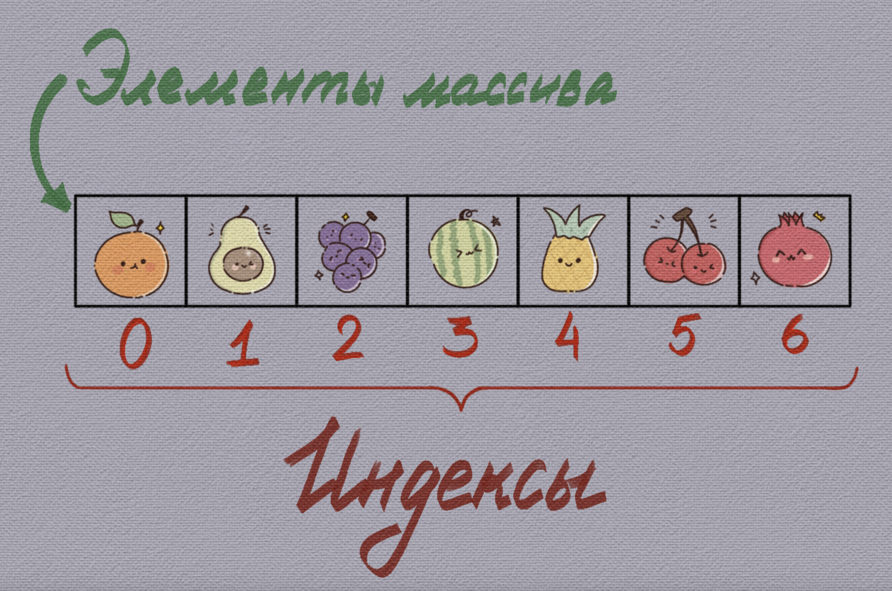

# Массивы в PHP

## Содержание

- [Массивы в PHP](#массивы-в-php)
  - [Содержание](#содержание)
  - [Вопросы для самопроверки](#вопросы-для-самопроверки)
  - [Результаты обучения](#результаты-обучения)
  - [Понятие массива](#понятие-массива)
    - [Определение](#определение)
    - [Отличие от массивов в других языках](#отличие-от-массивов-в-других-языках)
    - [Создание массива](#создание-массива)
    - [Отладочный вывод массива](#отладочный-вывод-массива)
  - [Ключи массива](#ключи-массива)
    - [Допустимые типы ключей](#допустимые-типы-ключей)
    - [Автоматическое назначение ключа](#автоматическое-назначение-ключа)
    - [Повторяющиеся ключи](#повторяющиеся-ключи)
  - [Доступ к элементам](#доступ-к-элементам)
    - [Чтение и изменение элемента](#чтение-и-изменение-элемента)
    - [Обращение к несуществующему ключу](#обращение-к-несуществующему-ключу)
  - [Перебор массива](#перебор-массива)
    - [Цикл foreach](#цикл-foreach)
    - [Цикл `for` и функция `count()`](#цикл-for-и-функция-count)
    - [Перебор массива в HTML-шаблоне](#перебор-массива-в-html-шаблоне)
  - [Добавление и удаление элементов](#добавление-и-удаление-элементов)
    - [Добавление в конец и в начало](#добавление-в-конец-и-в-начало)
    - [Удаление первого и последнего элемента](#удаление-первого-и-последнего-элемента)
    - [Удаление по ключу](#удаление-по-ключу)
    - [Сводная таблица](#сводная-таблица)
  - [Поиск, объединение и преобразование](#поиск-объединение-и-преобразование)
    - [Поиск значения](#поиск-значения)
    - [Объединение массивов](#объединение-массивов)
      - [Использование оператора `+`](#использование-оператора-)
      - [Использование функции `array_merge`](#использование-функции-array_merge)
      - [Использование оператора `...`](#использование-оператора--1)
    - [Преобразование между массивом и строкой](#преобразование-между-массивом-и-строкой)
    - [Сумма элементов](#сумма-элементов)
  - [Многомерные массивы](#многомерные-массивы)
    - [Массив массивов](#массив-массивов)
    - [Доступ к вложенным элементам](#доступ-к-вложенным-элементам)
    - [Вывод в виде HTML-таблицы](#вывод-в-виде-html-таблицы)
    - [Извлечение столбца](#извлечение-столбца)
  - [Сортировка](#сортировка)
    - [Правила сортировки](#правила-сортировки)
    - [Функции сортировки](#функции-сортировки)
  - [Сценарии использования массивов в PHP](#сценарии-использования-массивов-в-php)
    - [Хранение однотипных данных](#хранение-однотипных-данных)
    - [Ассоциативные массивы для описания сущностей](#ассоциативные-массивы-для-описания-сущностей)
    - [Работа с данными из базы данных](#работа-с-данными-из-базы-данных)
    - [Работа с файлами и конфигурациями](#работа-с-файлами-и-конфигурациями)
  - [Резюме](#резюме)

## Вопросы для самопроверки

1. Почему в массиве `['8' => 'a', 8 => 'b', '08' => 'c']` два элемента, а не три? Какие ключи он содержит?
2. Чем результат `isset($a['k'])` отличается от результата `array_key_exists('k', $a)`, если элемент `'k'` имеет значение `null`?
3. Почему после `unset()` перебор массива циклом `for` может пропустить элементы и как это исправить?
4. Как различаются результаты `$a + $b` и `array_merge($a, $b)` при совпадающих строковых ключах и при совпадающих числовых ключах?
5. Почему проверка `if (array_search($x, $list))` является ошибочной?

## Результаты обучения

После изучения главы студент сможет:

1. Объяснить устройство массива PHP как упорядоченного набора пар "ключ - значение" и правила преобразования ключей.
2. Создавать индексированные, ассоциативные и многомерные массивы, читать, изменять и удалять их элементы.
3. Выполнять перебор массива с помощью `foreach` и `for` и выбирать подходящую конструкцию.
4. Применять встроенные функции для поиска, объединения, преобразования и сортировки массивов с учётом строгости сравнения и сохранения ключей.
5. Объявлять функции с параметрами, значениями по умолчанию, объявлениями типов и возвращаемым значением.
6. Объяснить область видимости переменных и различие между передачей аргумента по значению и по ссылке.
7. Использовать анонимные и стрелочные функции в качестве callback-функций при обработке массивов.
8. Применять встроенные функции для работы со строками с учётом многобайтовой кодировки UTF-8.

## Понятие массива

### Определение

Вы уже знакомы с массивами из других курсов. В этом разделе мы затронем особенности массивов в PHP, их синтаксис и функции для работы с ними.

**Массив** - это структура данных, представляющая собой упорядоченный набор элементов, к каждому из которых можно обратиться по числовому индексу. Индексация, как правило, начинается с нуля. Элементами массива могут быть значения любого типа данных: числа, строки, логические значения, объекты и даже другие массивы.



_4.1. Пример массива_

### Отличие от массивов в других языках

Массивы в PHP устроены несколько иначе, чем в большинстве классических языков программирования. Если вы уже работали с Python или JavaScript, то почувствуете знакомую интонацию, но с нюансами.

В отличие от, например, C или Java, где массив - это строго упорядоченный набор элементов с числовыми индексами, в PHP массив - более гибкая структура. Он может вести себя и как список, и как словарь, и как нечто среднее между ними.

**Массив в PHP** - это упорядоченная структура данных, представляющая собой коллекцию элементов, связанных по принципу "ключ - значение"[^7].

В контексте массивов важно понимать два понятия:

- **Ключ**. Индекс, по которому осуществляется доступ к элементу массива.
- **Значение**. Данные, которые хранятся под конкретным ключом.

В PHP традиционно выделяют два основных типа массивов. Формально тип в языке один - `array`. Однако в реальной практике программирования он используется в двух логических формах.

- **Индексированный массив** - массив, ключами которого являются целые числа, по умолчанию начинающиеся с нуля. Используется для хранения списков однородных значений: названий, цен, идентификаторов.
- **Ассоциативный массив** - массив, ключами которого являются строки, обозначающие смысл значения. Используется для описания одной сущности с именованными полями: товара, пользователя, заказа.

> [!IMPORTANT]
> Ассоциативный массив PHP и объект JavaScript выглядят похоже, но являются разными механизмами. Массив PHP не имеет методов, копируется при присваивании и передаче в функцию (раздел 4.11.4) и сохраняет порядок элементов для ключей любого вида. Объекты в PHP существуют отдельно и будут рассмотрены в главе об объектно-ориентированном программировании.

### Создание массива

Есть два основных способа создания массива:

- С помощью квадратных скобок `[]`.
- С помощью функции `array()`. Этот способ работает и сегодня, но считается устаревшим стилем и в новом коде почти не встречается.

_Создание индексированного массива_

```php
// Устаревший стиль записи, но синтаксис поддерживается
$arr = array(1, 2, 3);

// Синтаксис с квадратными скобками (начиная с PHP 5.4)
$arr = [1, 2, 3];

// Создание массива с помощью индексов
$arr[0] = 1;
$arr[1] = 2;
$arr[2] = 3;

// Доступ к элементам массива
echo $arr[0]; // Вывод: 1
```

_Создание ассоциативного массива_

```php
$person = array(
    'name' => 'John',
    'age' => 30,
    'city' => 'New York'
);

// Синтаксис с квадратными скобками (начиная с PHP 5.4)
$person = [
    'name' => 'John',
    'age' => 30,
    'city' => 'New York'
];

// Вывод элемента массива
echo $person['name']; // John
echo $person['age']; // 30
echo $person['city']; // New York
```

### Отладочный вывод массива

Конструкция `echo` не может вывести массив: она предназначена для строк. Попытка выполнить `echo $product` выводит слово `Array` и предупреждение о преобразовании массива в строку. Для просмотра содержимого массива используются отладочные функции.

Функция `var_dump()`, рассмотренная в главе 3, выводит тип и значение каждого элемента. Более компактный вывод даёт функция `print_r()`.

_Синтаксис_

```php
print_r(mixed $value, bool $return = false): string|true
```

- `$value` - выводимое значение.
- `$return` - при значении `true` функция не печатает результат, а возвращает его строкой.
- При `$return = false` возвращает `true`.

_Пример_

```php
<?php

$product = [
    'name' => 'Ноутбук',
    'price' => 14999,
];

print_r($product);
var_dump($product);
```

Результат:

```text
Array
(
    [name] => Ноутбук
    [price] => 14999
)
array(2) {
  ["name"]=>
  string(14) "Ноутбук"
  ["price"]=>
  int(14999)
}
```

> [!TIP]
>
> В браузере переводы строк в выводе `print_r()` не отображаются. Чтобы сохранить форматирование, вывод оборачивают в тег `<pre>`:
>
> ```php
> echo '<pre>';
> print_r($product);
> echo '</pre>';
> ```

## Ключи массива

Прежде чем рассматривать операции с массивом, необходимо знать правила, по которым PHP обращается с ключами. Эти правила действуют при создании массива, при добавлении элемента и при чтении по ключу.

### Допустимые типы ключей

Ключом массива может быть только целое число (`int`) или строка (`string`). Значения других типов при использовании в качестве ключа преобразуются по следующим правилам:

| Исходный ключ | Результат | Пояснение                                                                        |
| ------------- | --------- | -------------------------------------------------------------------------------- |
| `'8'`         | `8`       | Строка, содержащая корректное десятичное целое число, становится числом          |
| `'08'`        | `'08'`    | Ведущий ноль не допускается, строка остаётся строкой                             |
| `'8.5'`       | `'8.5'`   | Строка с дробным числом остаётся строкой                                         |
| `true`        | `1`       | Логическое значение становится целым числом                                      |
| `false`       | `0`       | То же правило                                                                    |
| `null`        | `''`      | Становится пустой строкой                                                        |
| `1.9`         | `1`       | Дробная часть отбрасывается; начиная с PHP 8.1 выдаётся уведомление `Deprecated` |

Первые две строки таблицы означают, что ключи `8` и `'8'` обозначают один и тот же элемент, а ключи `8` и `'08'` обозначают разные элементы.

### Автоматическое назначение ключа

Если при создании элемента ключ не указан, PHP назначает ключ, равный наибольшему целому ключу массива плюс один. Если целых ключей в массиве ещё нет, назначается ключ `0`.

```php
$arr = [
    'name' => 'John',
    'city' => 'New York',
    'Delaware', // ключ 0 (следующий доступный)
    'USA',      // ключ 1
    'age' => 30,
    'Mexico',   // ключ 2
];

echo $arr[0];      // Delaware
echo $arr['age'];  // 30
echo $arr[2];      // Mexico
```

Строковые ключи на автоматическую нумерацию не влияют: после элемента `'age'` нумерация продолжается с того места, где она остановилась.

### Повторяющиеся ключи

Ключи внутри одного массива уникальны. Если один и тот же ключ указан дважды, второе значение заменяет первое, а позиция элемента сохраняется:

```php
<?php

$config = [
    'lang' => 'ro',
    'currency' => 'MDL',
    'lang' => 'ru',
];

print_r($config);
```

Результат:

```text
Array
(
    [lang] => ru
    [currency] => MDL
)
```

<details>
<summary>Проверьте себя. Сколько элементов будет в массиве <code>[1 => 'a', '1' => 'b', true => 'c', '01' => 'd']</code>?</summary>

Два элемента. Ключи `1`, `'1'` и `true` приводятся к одному целому ключу `1`, поэтому каждое следующее значение заменяет предыдущее, и под ключом `1` остаётся `'c'`. Ключ `'01'` содержит ведущий ноль и остаётся строкой, поэтому образует отдельный элемент.

</details>

## Доступ к элементам

### Чтение и изменение элемента

Обращение к элементу массива выполняется по ключу, указанному в квадратных скобках.

_Синтаксис_

```php
$array[key]
```

- В выражении возвращает значение элемента с указанным ключом.
- Слева от оператора присваивания изменяет значение существующего элемента или создаёт новый элемент с этим ключом.

_Пример_

```php
<?php

$product = [
    'name' => 'Ноутбук',
    'price' => 14999,
];

$categories = ['Ноутбуки', 'Мониторы'];

echo $product['name'];     // Ноутбук
echo $categories[1];       // Мониторы

$product['price'] = 13999;     // изменение существующего элемента
$product['stock'] = 3;         // создание нового элемента
```

Для добавления элемента в конец массива используется запись с пустыми квадратными скобками.

_Синтаксис_

```php
$array[] = value;
```

```php
<?php

$categories = ['Ноутбуки', 'Мониторы'];
$categories[] = 'Аксессуары';

print_r($categories);
// Array ( [0] => Ноутбуки [1] => Мониторы [2] => Аксессуары )
```

Если переменная ещё не существует, запись `$cart[] = 'Ноутбук';` создаёт новый массив из одного элемента. Код при этом работает, но читается хуже, чем явное создание пустого массива `$cart = [];` перед первым добавлением.

### Обращение к несуществующему ключу

Обращение к ключу, которого нет в массиве, приводит к предупреждению, а результатом выражения становится `null`:

```php
<?php

$product = ['name' => 'Ноутбук'];

echo $product['price'];
// Warning: Undefined array key "price"
```

Эта ситуация не является редкой. Данные, поступающие в web-приложение извне, часто содержат не все ожидаемые поля, поэтому наличие ключа следует проверять до обращения к нему. PHP предоставляет для этого три инструмента.

Первый инструмент - конструкция `isset()`.

_Синтаксис_

```php
isset(mixed $var, mixed ...$vars): bool
```

- `$var`, `...$vars` - проверяемые переменные или элементы массива.
- Возвращает `true`, если все переданные значения существуют и не равны `null`.
- Не выдаёт предупреждения при отсутствии ключа.

Второй инструмент - функция `array_key_exists()`.

_Синтаксис_

```php
array_key_exists(string|int $key, array $array): bool
```

- `$key` - проверяемый ключ.
- `$array` - массив, в котором выполняется проверка.
- Возвращает `true`, если ключ присутствует в массиве, независимо от значения элемента.

Третий инструмент - оператор `??`, рассмотренный в главе 3. Он возвращает значение элемента, если ключ существует и значение не равно `null`, и значение по умолчанию в противном случае.

_Пример_

```php
<?php

$product = [
    'name' => 'Ноутбук',
    'discount' => null,
];

var_dump(isset($product['discount']));  // bool(false)
var_dump(array_key_exists('discount', $product)); // bool(true)

echo $product['price'] ?? 'Цена не указана'; // Цена не указана
```

Различие между `isset()` и `array_key_exists()` проявляется только для элементов со значением `null`:

| Состояние элемента    | `isset($a['k'])` | `array_key_exists('k', $a)` | `$a['k'] ?? 'default'` |
| --------------------- | ---------------- | --------------------------- | ---------------------- |
| Ключа нет             | `false`          | `false`                     | `'default'`            |
| Значение `null`       | `false`          | `true`                      | `'default'`            |
| Значение `0` или `''` | `true`           | `true`                      | `0` или `''`           |
| Любое другое значение | `true`           | `true`                      | значение элемента      |

Для большинства практических задач достаточно оператора `??`: он одновременно проверяет наличие значения и подставляет значение по умолчанию. Функция `array_key_exists()` нужна тогда, когда необходимо отличить отсутствующее поле от поля, явно содержащего `null`.

## Перебор массива

### Цикл foreach

Цикл `foreach` предназначен специально для перебора массивов[^1]. Он последовательно выполняет тело для каждого элемента и не требует ни счётчика, ни знания количества элементов.

_Синтаксис_

```php
foreach ($array as $value) {
    // тело цикла
}

foreach ($array as $key => $value) {
    // тело цикла
}
```

- `array` - перебираемый массив.
- `$value` - переменная, которой перед каждым выполнением тела присваивается значение текущего элемента.
- `$key` - переменная, которой присваивается ключ текущего элемента. Указывается только тогда, когда ключ нужен в теле цикла.
- Элементы перебираются в порядке их расположения в массиве.

_Пример_. Перебор индексированного массива

```php
<?php

$categories = ['Ноутбуки', 'Мониторы', 'Аксессуары'];

foreach ($categories as $category) {
    echo $category . '<br>';
}
```

_Пример_. Перебор ассоциативного массива

```php
<?php

$product = [
    'name' => 'Ноутбук',
    'price' => 14999,
    'stock' => 3,
];

foreach ($product as $field => $value) {
    echo $field . ': ' . $value . '<br>';
}
```

Результат:

```text
name: Ноутбук<br>price: 14999<br>stock: 3<br>
```

Переменная `$value` содержит копию значения элемента. Присваивание ей нового значения не изменяет сам массив. Для изменения элементов в процессе перебора следует обращаться к массиву по ключу:

```php
<?php

$prices = ['laptop' => 14999, 'mouse' => 299];

foreach ($prices as $key => $price) {
    $prices[$key] = $price * 0.9;
}

print_r($prices);
// Array ( [laptop] => 13499.1 [mouse] => 269.1 )
```

<details>
<summary>Проверьте себя. Какие значения примет переменная <code>$key</code> при переборе <code>foreach ([10 => 'a', 20 => 'b'] as $key => $value)</code>?</summary>

`10`, затем `20`. Цикл `foreach` возвращает фактические ключи элементов, а не порядковые номера итераций.

</details>

### Цикл `for` и функция `count()`

Индексированный массив можно перебрать и циклом `for`. Для этого необходимо знать количество элементов, которое возвращает функция `count()`[^2].

_Синтаксис_

```php
count(Countable|array $value, int $mode = COUNT_NORMAL): int
```

- `$value` - массив.
- `$mode` - режим подсчёта. При значении `COUNT_RECURSIVE` учитываются также элементы вложенных массивов.
- Возвращает количество элементов.

_Пример_

```php
<?php

$categories = ['Ноутбуки', 'Мониторы', 'Аксессуары'];
$total = count($categories);

for ($i = 0; $i < $total; $i++) {
    echo ($i + 1) . '. ' . $categories[$i] . '<br>';
}
```

Результат функции `count()` сохранён в переменную до начала цикла, чтобы не вычислять количество элементов при каждой проверке условия.

### Перебор массива в HTML-шаблоне

Если необходимо перебрать массив в HTML-шаблоне, можно использовать альтернативный синтаксис цикла `foreach`, который позволяет вставлять PHP-код прямо в разметку.

_Синтаксис_

```php
<?php foreach ($array as $key => $value): ?>
    HTML-разметка
<?php endforeach; ?>
```

_Пример_

```php
<?php

$categories = ['Ноутбуки', 'Мониторы', 'Аксессуары'];

?>
<ul>
    <?php foreach ($categories as $category): ?>
        <li><?= $category ?></li>
    <?php endforeach; ?>
</ul>
```

Результат, полученный браузером:

```html
<ul>
  <li>Ноутбуки</li>
  <li>Мониторы</li>
  <li>Аксессуары</li>
</ul>
```

## Добавление и удаление элементов

Запись `$array[] = $value;` покрывает самый частый случай добавления элемента. Для остальных случаев PHP предоставляет функции, работающие с началом и концом массива, и конструкцию для удаления по ключу[^3].

### Добавление в конец и в начало

Функция `array_push()` добавляет один или несколько элементов в конец массива.

_Синтаксис_

```php
array_push(array &$array, mixed ...$values): int
```

- `$array` - изменяемый массив.
- `...$values` - добавляемые значения.
- Возвращает новое количество элементов.

Функция `array_unshift()` добавляет элементы в начало массива.

_Синтаксис_

```php
array_unshift(array &$array, mixed ...$values): int
```

- `$array` - изменяемый массив.
- `...$values` - добавляемые значения.
- Возвращает новое количество элементов.
- Числовые ключи массива пересчитываются заново, начиная с нуля. Строковые ключи сохраняются.

_Пример_

```php
<?php

$queue = ['Мышь', 'Клавиатура'];

array_push($queue, 'Монитор', 'Наушники');
array_unshift($queue, 'Ноутбук');

print_r($queue);
```

Результат:

```text
Array
(
    [0] => Ноутбук
    [1] => Мышь
    [2] => Клавиатура
    [3] => Монитор
    [4] => Наушники
)
```

Для добавления одного элемента в конец принято использовать запись `$queue[] = 'Монитор';`: она короче и выполняется без вызова функции. Функция `array_push()` удобна, когда добавляется сразу несколько значений.

### Удаление первого и последнего элемента

Функция `array_pop()` удаляет последний элемент массива и возвращает его значение.

_Синтаксис_

```php
array_pop(array &$array): mixed
```

- `$array` - изменяемый массив.
- Возвращает значение удалённого элемента или `null`, если массив пуст.

Функция `array_shift()` удаляет первый элемент массива и возвращает его значение.

_Синтаксис_

```php
array_shift(array &$array): mixed
```

- `$array` - изменяемый массив.
- Возвращает значение удалённого элемента или `null`, если массив пуст.
- Числовые ключи оставшихся элементов пересчитываются, начиная с нуля.

_Пример_

```php
<?php

$orders = ['#101', '#102', '#103'];

$first = array_shift($orders);   // '#101'
$last = array_pop($orders);      // '#103'

print_r($orders);
// Array ( [0] => #102 )
```

### Удаление по ключу

Конструкция `unset()` удаляет элемент с указанным ключом.

_Синтаксис_

```php
unset(mixed $var, mixed ...$vars): void
```

- `$var`, `...$vars` - удаляемые переменные или элементы массива.
- Если элемента не существует, конструкция ничего не делает и предупреждения не выдаёт.

_Пример_

```php
<?php

$fruits = ['apple', 'banana', 'orange'];

unset($fruits[1]);

print_r($fruits);
```

Результат:

```text
Array
(
    [0] => apple
    [2] => orange
)
```

После удаления ключи оставшихся элементов не пересчитываются: в массиве остаются ключи `0` и `2`, а ключ `1` отсутствует.

Отсюда следует практическое правило. Цикл `for` опирается на непрерывную нумерацию `0, 1, 2, ...`, поэтому после `unset()` обращение `$fruits[1]` выдаст предупреждение и вернёт `null`, а `count()` вернёт `2` и последний элемент с ключом `2` перебран не будет. Массив с пропусками перебирают циклом `foreach` либо предварительно восстанавливают нумерацию функцией `array_values()`.

_Синтаксис_

```php
array_values(array $array): array
```

- `$array` - исходный массив.
- Возвращает новый индексированный массив, содержащий те же значения в том же порядке с ключами `0, 1, 2, ...`.
- Исходный массив не изменяется.

_Пример_

```php
<?php

$fruits = ['apple', 'banana', 'orange'];
unset($fruits[1]);

$fruits = array_values($fruits);

print_r($fruits);
// Array ( [0] => apple [1] => orange )
```

### Сводная таблица

| Операция          | Средство                    | Изменяет массив              | Пересчитывает числовые ключи |
| ----------------- | --------------------------- | ---------------------------- | ---------------------------- |
| Добавить в конец  | `$a[] = $v`, `array_push()` | Да                           | Нет                          |
| Добавить в начало | `array_unshift()`           | Да                           | Да                           |
| Извлечь последний | `array_pop()`               | Да                           | Нет                          |
| Извлечь первый    | `array_shift()`             | Да                           | Да                           |
| Удалить по ключу  | `unset($a[$k])`             | Да                           | Нет                          |
| Перенумеровать    | `array_values()`            | Нет, возвращает новый массив | Да                           |

## Поиск, объединение и преобразование

### Поиск значения

Функция `in_array()` проверяет, содержится ли значение в массиве.

_Синтаксис_

```php
in_array(mixed $needle, array $haystack, bool $strict = false): bool
```

- `$needle` - искомое значение.
- `$haystack` - массив, в котором выполняется поиск.
- `$strict` - при значении `true` сравнение выполняется оператором `===`, при значении `false` оператором `==`.
- Возвращает `true`, если значение найдено.

Функция `array_search()` выполняет такой же поиск, но возвращает ключ найденного элемента.

_Синтаксис_

```php
array_search(mixed $needle, array $haystack, bool $strict = false): int|string|false
```

- `$needle` - искомое значение.
- `$haystack` - массив, в котором выполняется поиск.
- `$strict` - режим сравнения, аналогичный `in_array()`.
- Возвращает ключ первого найденного элемента или `false`, если значение не найдено.

_Пример_

```php
<?php

$categories = ['laptops', 'monitors', 'accessories'];

var_dump(in_array('monitors', $categories));      // bool(true)
var_dump(array_search('monitors', $categories));  // int(1)
var_dump(array_search('phones', $categories));    // bool(false)
```

По умолчанию обе функции сравнивают значения нестрого, то есть по правилам оператора `==` из главы 3. Это приводит к результатам, которые легко принять за ошибку, поэтому рекомендуется использовать строгий режим сравнения, когда это необходимо.

```php
<?php

$allowedIds = [10, 20, 30];

var_dump(in_array('10', $allowedIds));         // bool(true)
var_dump(in_array('10', $allowedIds, true));   // bool(false) - строгая проверка типа
```

Результат функции `array_search()` требует отдельного внимания. Если значение найдено в элементе с ключом `0`, функция возвращает `0`, которое в логическом контексте является ложным. Поэтому проверка результата должна выполняться строгим сравнением с `false`:

```php
<?php

$categories = ['laptops', 'monitors'];
$key = array_search('laptops', $categories);   // 0

if ($key !== false) {
    echo 'Категория найдена под ключом ' . $key;
}
```

Запись `if ($key)` в этом случае ошибочно сочла бы найденный элемент отсутствующим.

### Объединение массивов

Для объединения массивов в PHP существуют несколько методов, самые распространенные из которых:

- Оператор `+`;
- Функция `array_merge()`;
- С помощью оператора `...` (оператор распаковки массивов).

#### Использование оператора `+`

Оператор `+` объединяет массивы по ключам.

Он работает следующим образом:

- Если ключи массивов не пересекаются, элементы второго массива добавляются в результирующий.
- Если ключи пересекаются, элементы из первого массива имеют приоритет.
- Порядок массивов имеет значение: сначала учитываются элементы первого массива, затем второго.

_Пример_. Объединение индексированных массивов

```php
<?php

$fruits1 = ['apple', 'banana'];
$fruits2 = ['orange', 'grape'];

// Объединение
$allFruits = $fruits1 + $fruits2;

print_r($allFruits);
```

Результат:

```text
Array
(
    [0] => apple
    [1] => banana
)
```

_Почему в результате только элементы первого массива?_

- Массив `$fruits1` содержит элементы с ключами `0` и `1` (`0 => 'apple', 1 => 'banana'`).
- Массив `$fruits2` также содержит элементы с ключами `0` и `1` (`0 => 'orange', 1 => 'grape'`).
- Оператор `+` берёт все элементы первого массива, а из второго добавляет только те, чьих ключей ещё нет.
- Ключи `0` и `1` уже заняты, поэтому элементы `$fruits2` в результат не попадают.

> [!WARNING]
> Для объединения списков оператор `+` почти всегда даёт не тот результат, который ожидают: часть значений молча теряется. Списки объединяют функцией `array_merge()` или оператором `...`.

_Пример_. Объединение ассоциативных массивов

```php
<?php

$person1 = [
    'name' => 'John',
    'age' => 30
];

$person2 = [
    'age' => 25,
    'city' => 'New York'
];

// Объединение массивов
$person = $person1 + $person2;

print_r($person);
```

Результат:

```text
Array
(
    [name] => John
    [age] => 30
    [city] => New York
)
```

#### Использование функции `array_merge`

Функция `array_merge()` объединяет два или более массивов в один:

- В индексированных массивах элементы добавляются в порядке передачи, а числовые ключи пересчитываются заново.
- В ассоциативных массивах при совпадении строковых ключей значения заменяются значениями из последнего переданного массива.

_Синтаксис_:

```php
array_merge(array ...$arrays): array
```

- `$arrays` - массивы, которые нужно объединить.
- _Возвращаемое значение_. Новый массив, содержащий элементы всех переданных массивов.

_Пример_. Объединение индексированных массивов при помощи `array_merge`

```php
<?php

$fruits1 = ['apple', 'banana'];
$fruits2 = ['orange', 'grape'];

// Объединение массивов
$allFruits = array_merge($fruits1, $fruits2);

print_r($allFruits);
```

Результат:

```text
Array
(
    [0] => apple
    [1] => banana
    [2] => orange
    [3] => grape
)
```

_Пример_. Объединение ассоциативных массивов

```php
<?php

$person1 = [
    'name' => 'John',
    'age' => 30
];

$person2 = [
    'age' => 25,
    'city' => 'New York'
];

// Объединение массивов
$person = array_merge($person1, $person2);

print_r($person);
```

_Результат:_

```text
Array
(
    [name] => John
    [age] => 25
    [city] => New York
)
```

Значение ключа `'age'` из `$person2` заменяет значение из `$person1`, поскольку второй массив имеет приоритет при совпадении строковых ключей.

#### Использование оператора `...`

`...` - spread-оператор (оператор распаковки), который позволяет «распаковать» массив в месте его использования, например при объединении массивов. Распаковка массивов со строковыми ключами поддерживается начиная с PHP 8.1.

```php
[...$массив_1, ...$массив_2]
```

_Пример_. Индексированные массивы

```php
<?php

$first = ['apple', 'banana'];
$second = ['orange', 'grape'];

print_r([...$first, ...$second]);
```

Результат:

```text
Array
(
    [0] => apple
    [1] => banana
    [2] => orange
    [3] => grape
)
```

_Пример_. Ассоциативные массивы

```php
$person1 = [
    'name' => 'John',
    'age' => 30
];

$person2 = [
    'age' => 25,
    'city' => 'New York'
];

print_r([...$person1, ...$person2]);
```

Результат:

```text
Array
(
    [name] => John
    [age] => 25
    [city] => New York
)
```

### Преобразование между массивом и строкой

Функция `implode()` объединяет элементы массива в строку, вставляя между ними разделитель[^4].

_Синтаксис_

```php
implode(string $separator, array $array): string
```

- `$separator` - строка, вставляемая между элементами.
- `$array` - массив объединяемых значений.
- Возвращает полученную строку.

Функция `explode()` выполняет обратное действие: разбивает строку на части по разделителю.

_Синтаксис_

```php
explode(string $separator, string $string, int $limit = PHP_INT_MAX): array
```

- `$separator` - разделитель. Не может быть пустой строкой.
- `$string` - исходная строка.
- `$limit` - максимальное количество элементов результата. Последний элемент содержит весь остаток строки.
- Возвращает массив частей.

_Пример_

```php
<?php

$tags = ['php', 'web', 'backend'];
echo implode(', ', $tags);        // php, web, backend

$input = 'ноутбук,монитор,мышь';
$items = explode(',', $input);
print_r($items);                  // [0 => ноутбук, 1 => монитор, 2 => мышь]

print_r(explode(',', $input, 2)); // [0 => ноутбук, 1 => монитор,мышь]
```

Две особенности `explode()` проявляются на граничных данных. Два разделителя подряд порождают пустой элемент: `explode(',', 'a,,b')` возвращает три элемента, средний из которых пустая строка. Разбиение пустой строки возвращает не пустой массив, а массив из одной пустой строки.

> [!NOTE]
> В ранних версиях PHP функция `implode()` допускала обратный порядок аргументов: сначала массив, затем разделитель. Начиная с PHP 8 такой вызов приводит к ошибке `TypeError`. В старом коде и старых учебниках встречаются оба варианта.

### Сумма элементов

Функция `array_sum()` вычисляет сумму числовых значений массива.

_Синтаксис_

```php
array_sum(array $array): int|float
```

- `$array` - массив чисел.
- Возвращает сумму элементов; для пустого массива возвращает `0`.

_Пример_

```php
<?php

$cartPrices = [14999, 299, 1899];

echo array_sum($cartPrices);   // 17197
```

## Многомерные массивы

### Массив массивов

Значением элемента массива может быть другой массив. Такая структура называется многомерной.

**Многомерный массив** - массив, элементы которого являются массивами.

Наиболее распространённая форма в web-разработке - _индексированный массив, каждый элемент которого является ассоциативным массивом с одинаковым набором ключей_. Эта форма соответствует таблице: элемент внешнего массива представляет строку, ключ внутреннего массива представляет столбец.

```php
<?php

$products = [
    ['id' => 1, 'name' => 'Ноутбук', 'price' => 14999],
    ['id' => 2, 'name' => 'Мышь', 'price' => 299],
    ['id' => 3, 'name' => 'Монитор', 'price' => 3499],
];
```

```text
$products
│
├── [0] ─┬── 'id'    => 1
│        ├── 'name'  => 'Ноутбук'
│        └── 'price' => 14999
│
├── [1] ─┬── 'id'    => 2
│        ├── 'name'  => 'Мышь'
│        └── 'price' => 299
│
└── [2] ─┬── 'id'    => 3
         ├── 'name'  => 'Монитор'
         └── 'price' => 3499
```

В таком виде в приложение поступают результаты запросов к базе данных, поэтому умение обрабатывать массив массивов понадобится во всех последующих главах.

### Доступ к вложенным элементам

Для обращения к вложенному элементу квадратные скобки записываются последовательно: сначала ключ внешнего массива, затем ключ внутреннего.

_Синтаксис_

```php
$array[ключ_внешнего][ключ_внутреннего]
```

_Пример_

```php
<?php

$products = [
    ['id' => 1, 'name' => 'Ноутбук', 'price' => 14999],
    ['id' => 2, 'name' => 'Мышь', 'price' => 299],
];

echo $products[1]['name'];   // Мышь

$products[0]['price'] = 13999;
```

Перебор выполняется циклом `foreach`, в котором переменная цикла получает очередной внутренний массив:

```php
<?php

$products = [
    ['id' => 1, 'name' => 'Ноутбук', 'price' => 14999],
    ['id' => 2, 'name' => 'Мышь', 'price' => 299],
];

foreach ($products as $product) {
    echo $product['name'] . ': ' . $product['price'] . ' лей<br>';
}
```

### Вывод в виде HTML-таблицы

Сочетание многомерного массива и альтернативного синтаксиса позволяет сформировать таблицу, в которой количество строк определяется данными:

```php
<?php

$products = [
    ['id' => 1, 'name' => 'Ноутбук', 'price' => 14999],
    ['id' => 2, 'name' => 'Мышь', 'price' => 299],
    ['id' => 3, 'name' => 'Монитор', 'price' => 3499],
];

?>
<table>
    <tr>
        <th>ID</th>
        <th>Товар</th>
        <th>Цена</th>
    </tr>
    <?php foreach ($products as $product): ?>
        <tr>
            <td><?= $product['id'] ?></td>
            <td><?= $product['name'] ?></td>
            <td><?= $product['price'] ?> лей</td>
        </tr>
    <?php endforeach; ?>
</table>
```

Добавление товара в массив автоматически добавляет строку в таблицу: разметку изменять не требуется.

### Извлечение столбца

Функция `array_column()` извлекает из многомерного массива значения одного столбца[^5].

_Синтаксис_

```php
array_column(array $array, int|string|null $column_key, int|string|null $index_key = null): array
```

- `$array` - многомерный массив.
- `$column_key` - ключ столбца, значения которого извлекаются. При значении `null` извлекаются внутренние массивы целиком.
- `$index_key` - ключ столбца, значения которого становятся ключами результата. Если не указан, результат индексируется с нуля.
- Возвращает новый массив.

_Пример_

```php
<?php

$products = [
    ['id' => 7, 'name' => 'Ноутбук', 'price' => 14999],
    ['id' => 9, 'name' => 'Мышь', 'price' => 299],
];

print_r(array_column($products, 'name'));
// Array ( [0] => Ноутбук [1] => Мышь )

print_r(array_column($products, 'name', 'id'));
// Array ( [7] => Ноутбук [9] => Мышь )

echo array_sum(array_column($products, 'price'));   // 15298
```

Второй вызов строит справочник "идентификатор - название", удобный для быстрого поиска по идентификатору. Последняя строка показывает, как функции комбинируются: `array_column()` извлекает цены, а `array_sum()` вычисляет их сумму.

## Сортировка

### Правила сортировки

Функции сортировки PHP[^6] различаются по трём признакам, и выбор функции сводится к ответу на три вопроса:

1. Сортировать по значениям или по ключам?
2. Сохранять ли связь между ключом и значением?
3. По возрастанию или по убыванию?

| Функция    | Сортирует по | Связь "ключ - значение"               | Порядок        |
| ---------- | ------------ | ------------------------------------- | -------------- |
| `sort()`   | Значениям    | Не сохраняется, ключи пересчитываются | По возрастанию |
| `rsort()`  | Значениям    | Не сохраняется, ключи пересчитываются | По убыванию    |
| `asort()`  | Значениям    | Сохраняется                           | По возрастанию |
| `arsort()` | Значениям    | Сохраняется                           | По убыванию    |
| `ksort()`  | Ключам       | Сохраняется                           | По возрастанию |
| `krsort()` | Ключам       | Сохраняется                           | По убыванию    |

Буква `a` в названии означает "associative" (связь с ключами сохраняется), буква `k` означает "key" (сортировка по ключам), буква `r` означает "reverse" (обратный порядок).

Все функции сортировки изменяют переданный массив непосредственно и не возвращают отсортированную копию.

### Функции сортировки

Все шесть функций имеют одинаковую сигнатуру. Ниже она приведена для `sort()`.

_Синтаксис_

```php
sort(array &$array, int $flags = SORT_REGULAR): true
```

- `$array` - сортируемый массив, изменяется непосредственно.
- `$flags` - способ сравнения элементов:
  - `SORT_REGULAR` - сравнение по правилам операторов `<` и `>` (по умолчанию).
  - `SORT_NUMERIC` - элементы сравниваются как числа.
  - `SORT_STRING` - элементы сравниваются как строки.
- Всегда возвращает `true`.

_Пример_

```php
<?php

$prices = [
    'laptop' => 14999,
    'mouse' => 299,
    'monitor' => 3499,
];

$byValue = $prices;
sort($byValue);
print_r($byValue);
// Array ( [0] => 299 [1] => 3499 [2] => 14999 )

$byValueWithKeys = $prices;
asort($byValueWithKeys);
print_r($byValueWithKeys);
// Array ( [mouse] => 299 [monitor] => 3499 [laptop] => 14999 )

$byKey = $prices;
ksort($byKey);
print_r($byKey);
// Array ( [laptop] => 14999 [monitor] => 3499 [mouse] => 299 )
```

Результат первой сортировки показывает главную опасность функции `sort()`: для ассоциативного массива она сохраняет значения, но теряет ключи. Цены остались, а сведения о том, к какому товару относится каждая цена, утрачены. Для ассоциативных массивов следует использовать `asort()` или `arsort()`.

Флаг сравнения влияет на результат, когда массив содержит числа, записанные строками:

```php
<?php

$sizes = ['10', '9', '2', '1'];

sort($sizes);
print_r($sizes);                 // 1, 2, 9, 10

sort($sizes, SORT_STRING);
print_r($sizes);                 // 1, 10, 2, 9
```

При строковом сравнении строка `'10'` оказывается меньше строки `'2'`, так как сравнение выполняется посимвольно, и символ `1` предшествует символу `2`.

Сортировка многомерного массива по значению одного из полей, например списка товаров по цене, требует передачи в функцию правила сравнения. Для этого используется функция `usort()`, которая рассматривается в разделе 4.14.4 после введения функций.

## Сценарии использования массивов в PHP

Массивы в PHP используются повсеместно благодаря их гибкости и универсальности.

В данной главе мы рассмотрим основные сценарии использования массивов, а также задачи, которые они помогают решать.

### Хранение однотипных данных

Массивы идеально подходят для хранения набора однотипных данных, например строк, чисел или объектов. Это позволяет легко организовать список элементов и выполнять над ними операции.

_Пример_. Шаблон "Список товаров"

```php
<?php $products = ['Laptop', 'Smartphone', 'Tablet']; ?>
<ul>
<?php foreach ($products as $product): ?>
    <li><?php echo $product; ?></li>
<?php endforeach; ?>
</ul>
```

### Ассоциативные массивы для описания сущностей

Ассоциативные массивы часто используются для представления сущностей, где ключи выступают в роли атрибутов объекта.

_Пример_. Описание пользователя

```php
<?php

$user = [
    'name' => 'John',
    'email' => 'john.doe@example.com',
    'birthday' => new DateTime('1990-01-01'),
];

?>

<div>
   <h1>User: <?php echo $user['name']; ?></h1>
   <p>Email: <?php echo $user['email']; ?></p>
   <p>Birthday: <?php echo $user['birthday']->format('Y-m-d'); ?></p>
</div>
```

_Почему в данном случае лучше использовать массив?_

В данном случае данные пользователя сгруппированы в одной структуре, что упрощает передачу и обработку информации.

_Пример_. Отдельные переменные и ассоциативный массив

```php
<?php

// Отдельные переменные
$name = 'John';
$email = 'john@mail.ru';
$birthday = new DateTime('1990-01-01');

// Ассоциативный массив
$user = [
    'name' => 'John',
    'email' => 'john@mail.ru',
    'birthday' => new DateTime('1990-01-01'),
];
```

### Работа с данными из базы данных

Массивы играют ключевую роль при работе с базами данных. Результаты запросов обычно возвращаются в виде массивов.

_Пример_. Список пользователей из базы данных

```php
<?php

// Данные, извлечённые из таблицы `users`
// Таблица содержит поля `id`, `name`, `email`
$users = [
    ['id' => 1, 'name' => 'John', 'email' => 'john@example.com'],
    ['id' => 2, 'name' => 'Alice', 'email' => 'alice@example.com'],
    ['id' => 3, 'name' => 'Bob', 'email' => 'bob@example.com'],
];

?>

<ul>
    <?php foreach ($users as $user) : ?>
        <li>
            <a href="/user.php?id=<?php echo htmlspecialchars($user['id']) ?>">
                <?php echo htmlspecialchars($user['name']); ?>
            </a>
        </li>
    <?php endforeach; ?>
</ul>
```

### Работа с файлами и конфигурациями

Массивы часто применяются для хранения конфигурационных данных или параметров приложения.

_Пример_. Чтение конфигурации из файла

```php
<?php

$config = [
    'db_host' => 'localhost',
    'db_name' => 'my_database',
    'db_user' => 'root',
    'db_password' => ''
];

echo "Подключение к базе данных: " . $config['db_name'];
```

## Резюме

1. Массив PHP является упорядоченным набором пар "ключ - значение" и заменяет одновременно список и словарь; ключом может быть только целое число или строка.
2. Ключи, которые после преобразования совпадают, обозначают один элемент, а автоматический ключ равен наибольшему целому ключу плюс один.
3. Обращение к несуществующему ключу вызывает предупреждение, поэтому наличие ключа проверяется через `??`, `isset()` или `array_key_exists()`.
4. Для перебора массивов используется `foreach`; цикл `for` требует непрерывной нумерации ключей.
5. Функции `in_array()` и `array_search()` по умолчанию сравнивают нестрого, а результат `array_search()` проверяется оператором `!== false`.
6. Функция `sort()` теряет ключи ассоциативного массива; для таких массивов используются `asort()`, `arsort()` и `ksort()`, а для сортировки по произвольному правилу `usort()`.

[^1]: The PHP Group (2026). _foreach_. PHP Manual. Available at: https://www.php.net/manual/en/control-structures.foreach.php

[^2]: The PHP Group (2026). _count_. PHP Manual. Available at: https://www.php.net/manual/en/function.count.php

[^3]: The PHP Group (2026). _Array Functions_. PHP Manual. Available at: https://www.php.net/manual/en/ref.array.php

[^4]: The PHP Group (2026). _implode_. PHP Manual. Available at: https://www.php.net/manual/en/function.implode.php

[^5]: The PHP Group (2026). _array_column_. PHP Manual. Available at: https://www.php.net/manual/en/function.array-column.php

[^6]: The PHP Group (2026). _Sorting Arrays_. PHP Manual. Available at: https://www.php.net/manual/en/array.sorting.php

[^7]: The PHP Group (2026). _Arrays_. PHP Manual. Available at: https://www.php.net/manual/en/language.types.array.php
